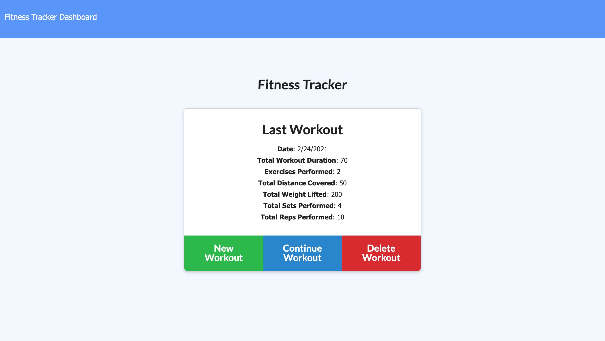
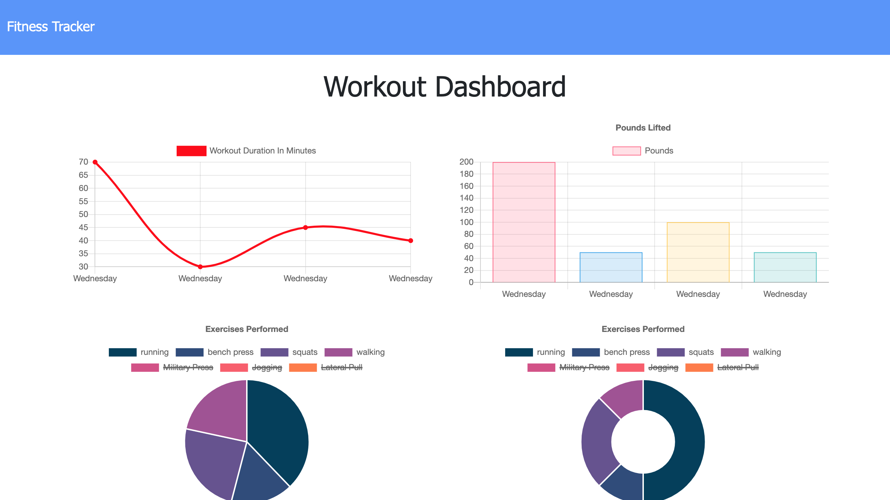

# Workout-Tracker
A Mongo/Express based workout tracker.

## Table of Contents
1. [ Description ](#desc)
2. [ Visuals ](#visuals)
3. [ Deployed Webpage ](#deployed)
4. [ Support ](#support)
5. [ Next Steps ](#next_steps)
6. [ Authors and Acknowledgement ](#acknowledge)
7. [ License ](#license)

## 1. Description
This workout tracker allows you to create workouts and add exercises to them. It also has a `dashboard` page that allows you to view your stats from your last seven workouts. You can also delete the last workout.

### Summary of Functionality

With this app, you can:
* View statistics from workouts that you have previously completed in the dashboard.
* Create workouts.
* Update workouts to add exercises.
* Delete your current workout.

## 2. Visuals
Screenshots of the webpage:

## 3. Deployed Webpage
[The deployed site](https://workout-tracker12345.herokuapp.com/), hosted by Heroku.

## 4. Support
Should you find an issue with this webpage, please create a [new issue](https://github.com/Tasha876/Workout-Tracker/issues/new/choose) on my GitHub repository.

## 5. Next steps
This workout tracker is an ongoing project. Some next steps include:

* Adding the functionality to delete exercises as well as complete workouts.
* Fixing the bug (on the front-end) with duplicate exercises showing as undefined on the stats page in the circle graphs.
* Getting rid of the flashes when loading pages.

## 6. Authors and Acknowledgement
This back-end portion of this site was created entirely by Natasha Fray using Mongodb. The front end was provided by the [UofT Coding Bootcamp](https://bootcamp.learn.utoronto.ca/)

## 7. License
This project is covered by the [MIT](LICENSE) license.

